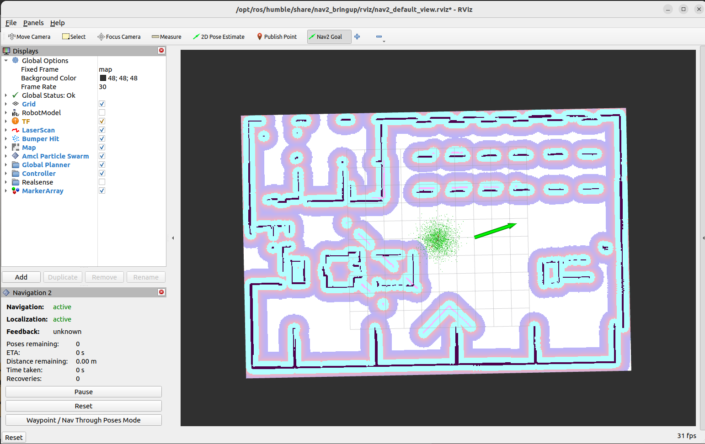

# mecanum_nav
## Package test_mecanum
### Config cần thay đổi
Trong file _mpo_500.urdf.xacro_ (i.e. đường dẫn : _/mecanum_nav/src/test_mecanum/urdf/mpo_500.urdf.xacro_), tìm dòng code này và các dòng tương tự
```
<mesh filename="file:///home/mark/mecanum_nav/install/test_mecanum/share/test_mecanum/meshes/MPO-500-BODY.dae" scale="0.001 0.001 0.001"/>
```
Thay đổi link filename bằng cách đổi _mark_ thành username của máy mình.

### Lệnh cần chạy
Build package test_mecanum
```
cd mecanum_nav
colcon build --packages-select test_mecanum
```
Chạy lệnh launch này để hiện gazebo+rviz
```
ros2 launch test_mecanum zm_robot_aws_warehouse.launch.py 
```

### Kết quả
Rviz và gazebo khởi tạo 


__Thực hiện trên rviz__
Chọn 2D Pose Estimate để khởi tạo vị trí ban đầu

Chọn Nav2Goal để chọn hướng và vị trí muốn đến


---
## Package mecanum
### Config cần thay đổi
Trong file zm_robot.urdf.xacro, (i.e. đường dẫn : /mecanum_nav/src/mecanum/urdf/zm_robot.urdf.xacro)
```
<xacro:include filename="/home/mark/me/install/mecanum/share/mecanum/urdf/materials.xacro" />
```
Thay đổi filename bằng cách đổi mark thành username trên máy mình.
### Lệnh cần chạy
Build package mecanum
```
cd mecanum_nav
colcon build --packages-select test_mecanum
```
Chạy lệnh launch này để hiện gazebo
```
ros2 launch mecanum zm_robot_empty_world.launch.py
```
#### Chạy động học thuận
```
ros2 run mecanum control_lifecycle
```
Set state
```
ros2 lifecycle set /lc_Control configure
ros2 lifecycle set /lc_Control activate
```
#### Chạy động học ngược
```
ros2 run mecanum followpath_lifecycle
```
Set state
```
ros2 lifecycle set /lc_FollowPath configure
ros2 lifecycle set /lc_FollowPath activate
```
Nhưng chạy động học ngược không ổn do chỉ áp dụng động học ngược mà không suy xét đến follow theo từng điểm nhỏ tạo ra bởi path và không có feedback và odom nên bị sai. => Dùng nav2 ở package test_mecanum.


